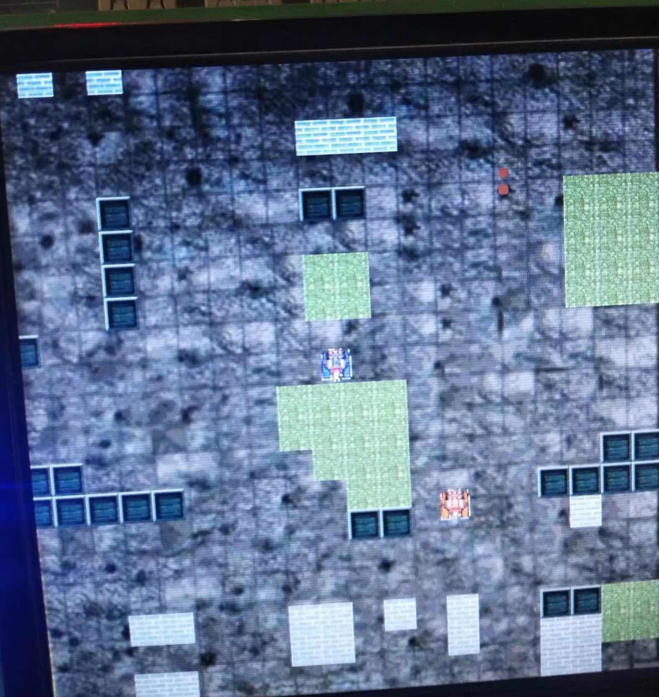
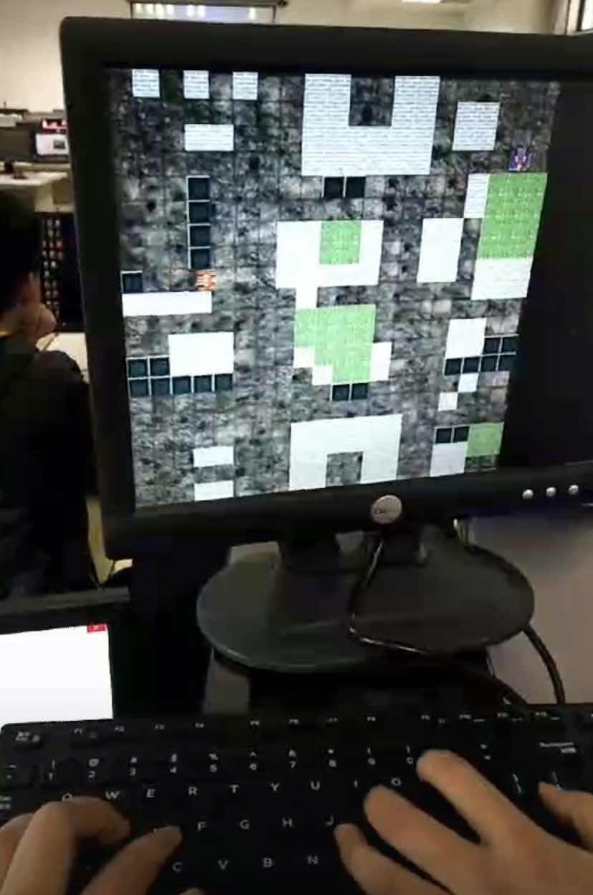

# Tank_Battle
Tank Battle  for digital logic design

### 分工
lsh：输入模块、游戏逻辑 

cyy：美工、游戏逻辑

mcl：输出模块、游戏逻辑

lhh：统筹各个模块的设计、参与各个模块的实现

### 功能概述

我们的《坦克大战》为双人对战游戏，双方玩家使用键盘控制坦克在战场上的移动、射击。游戏的目标为保护己方基地、摧毁对方基地。在游戏中， 玩家可以攻击对方坦克、摧毁战场上的可摧毁方块。

使用开关初始化游戏，玩家一使用 WSAD 控制上下左右移动，使用空格键控制子弹发射；玩家二使用上下左右箭头键控制移动，使用回车键控制子弹发射。双方坦克不能穿过边界和砖 块等障碍物。当玩家击毁对方坦克时，显示胜利玩家，游戏结束。

详细内容可以看report

### 效果展示
<table>
  <tr>
    <td></td>
    <td></td>
  </tr>
</table>

